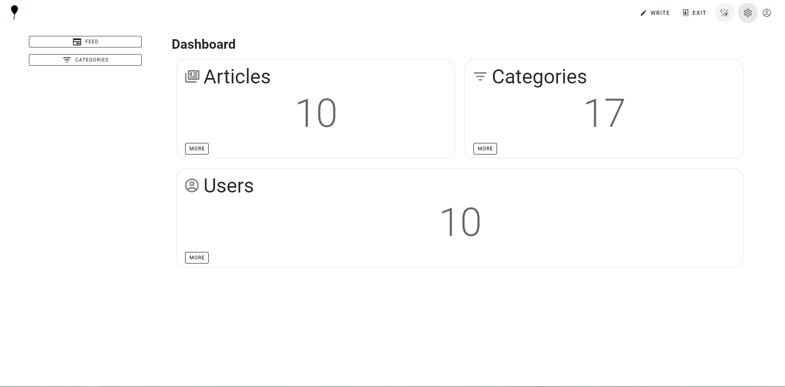
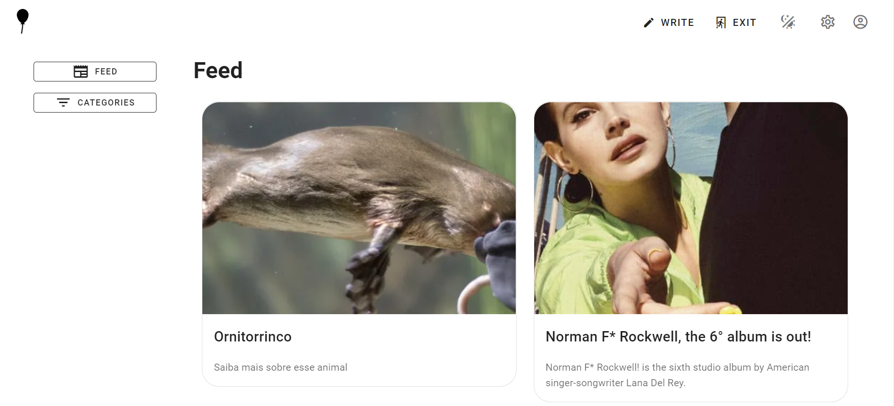
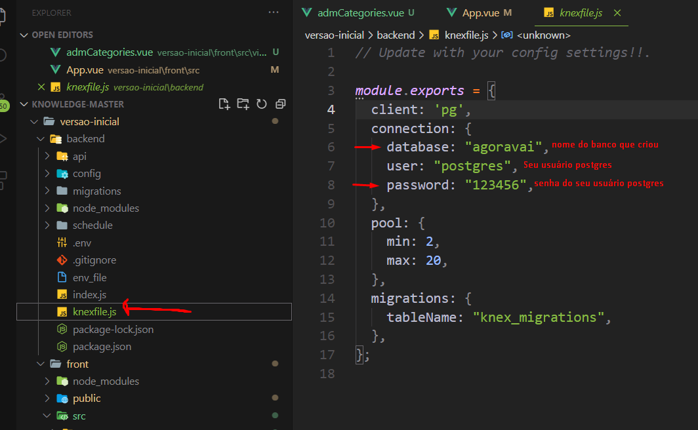
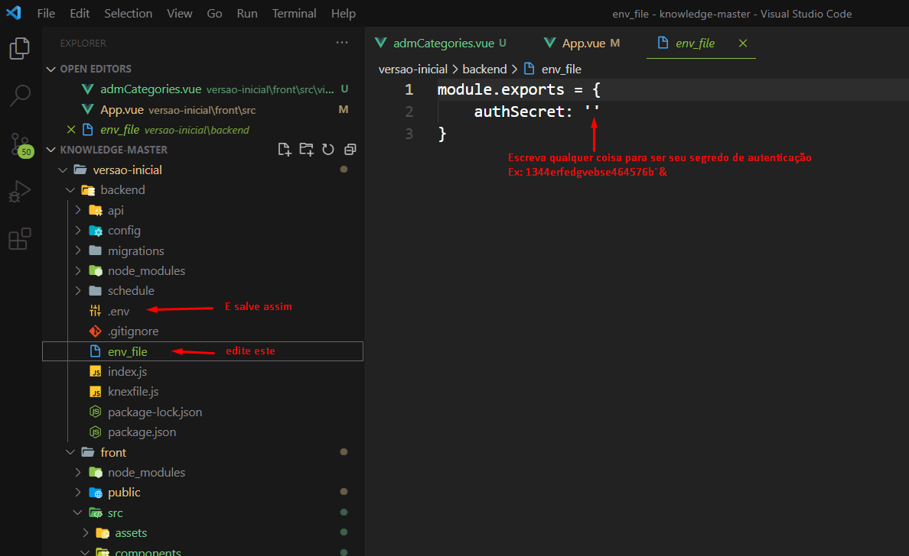

# Ballow
## Back-end

O back-end, feito em node.js, é composto de 2 bancos de dados, o principal, PostgreSql para os artigos, usuários e categorias. E o secundário, MongoDb, para as estatísticas. O knex se encarrega de intermediar a comunicação do banco Postgres e o node-schedule se encarrega de, a cada hora, realizar uma contagem no banco SQL e armazenar no banco não relacional para mostrar estatísticas. 
No que tange a segurança, a plataforma utiliza o jwt para gerar tokens que expiram a cada 24hs e o passport para validação, além do BCrypt para gerar senhas criptografadas. 
As requisições HTTP no back-end são mediadas pelo Express.

## front-end

O front-end é construído usando o (belíssimo) framework vue.js e toda a família vue (vuex & vue router). 
Utilizei também o framework Vuetify que fornece compoentes prontos que se enquadram no Material Design e o MDIcons.
No front-end, o Axios é o responsável pelas requisições HTTP.

----

## Introdução
Ballow /bálou/ nasceu como meu primeiro projeto, baseado no projeto de conclusão "Base de Conhecimento" do curso Web Moderno 

----

## Disclaimer
Ainda me enquadro na categoria de programador júnior, estou estudando a 4 meses e, a priori, com foco em front-end. Sendo assim,o front-end deste projeto se diferencia muito do projeto "mãe" e o back-end não. Um back-end um pouquinho mais elaborado você pode encontrar no meu outro projeto (até hoje, dia 28/06/2021, ainda não postado) o Boblee /bóbli/, um mock site de perguntas e respostas. Agora sem mais delongas, vamos continuar :).

----

## O que é o Ballow? 
O Ballow se baseia no site Medium, ou seja, um blog pessoal. 

## Como funciona? 
### Existem 3 atores ao todo:
- O visitante, que apenas navega pelo feed e lê os artigos e categorias. 
- O escritor, que participa mais ativamente e tem permissão de postar artigos.
- O Administrador, que pode auditar todos os artigos, categorias e usuários, removendo, editando ou apagando qualquer um dos itens anteriormente citados. Apenas este ator pode criar novas categorias e apenas este ator tem acesso as estatísticas. 

Dashboard do administrador e estatísticas da plataforma.

----

## Possíveis futuras implementações (problemas conhecidos)
- O ator escritor ainda não tem tanta autonomia (algo que melhorei no outro projeto já citado, o Boblee), por exemplo, ele não pode criar uma categoria ou editar o próprio perfil, apenas editar os própios artigos. Por outro lado, evitar que qualquer usuário crie categorias é uma forma de melhor controle sob as categorias;

- Feed pobre de recursos. Ainda não existe uma forma de comentar, votar ou salvar os artigos de outros usários; 

# Vídeo de demonstração 

Clique na imagem acima e veja o vídeo de demonstração

# Alguns fluxos

  
Criar um novo artigo.

  
Login.

  
Criar novo usuário.

# Como rodar na sua máquina? 

- Instale o banco de dados Postgres SQL e o mongoDB, será necessário configurar o path desses 2 bancos, uma rápida pesquisa no google te dará todas as informações necessárias, melhor do que eu explicando. 

- Crie um banco de dados no postgres, com o nome que quiser. Mas lembre deste nome!

- Instale o knex globalmente via npm

 
Após criar o banco modifique o knexfile na pasta backend como está acima

Depois localize o env file, adicione algo no seu authsecret e salve o arquivo exatamente como ".env" sem aspas.

Após isso, inicie o projeto...

----
`npm run serve`

para o front end

----

`npm start`

para o back end

----

(Você deve ter o node e npm instalados na sua máquina, ok?! ;] )

- Crie um usuário no site, ele não será administrador. Para isso você deve ir no seu banco e mudar esse primeiro usuário para administrador (settar true na coluna admin). Esse passo apenas se faz necessário para o primeiro usuário, apartir daí você pode editar tudo como administrador apatir da plataforma. 

# E... fim...

Apenas com esses passos você deverá ver o ballow ganhando vida no seu computador!

# Disclaimer 2 
Minhas redes estão no meu perfil do github, qualquer comentário ou feedback será aceito desde que seja feito COM EDUCAÇÃO visando ser uma crítica construtíva, afinal ainda sou iniciante e se você já é experiente, não esqueça que um dia você foi iniciante também. 

Vida longa e próspera :vulcan_salute: